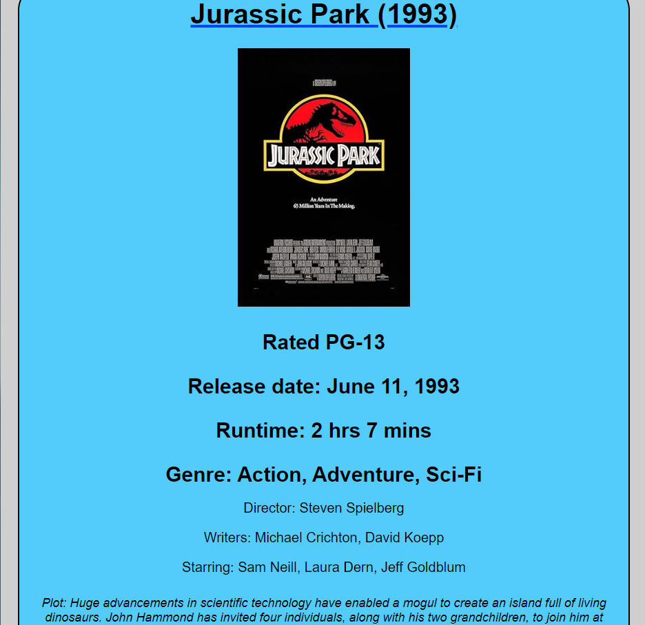
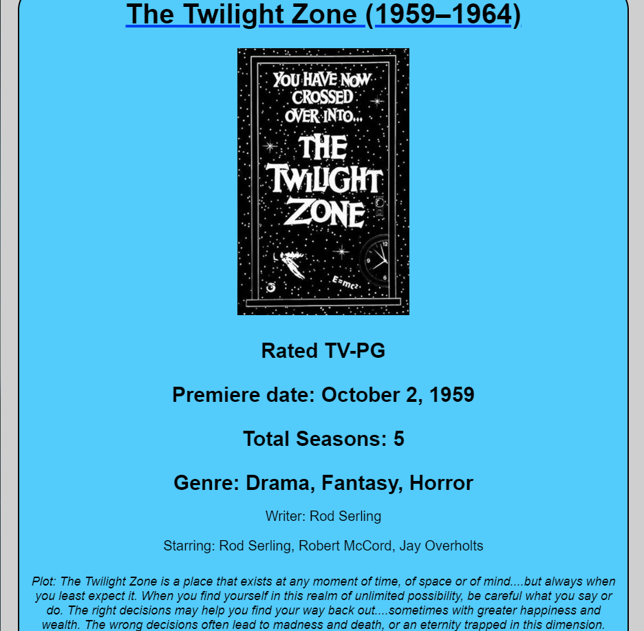
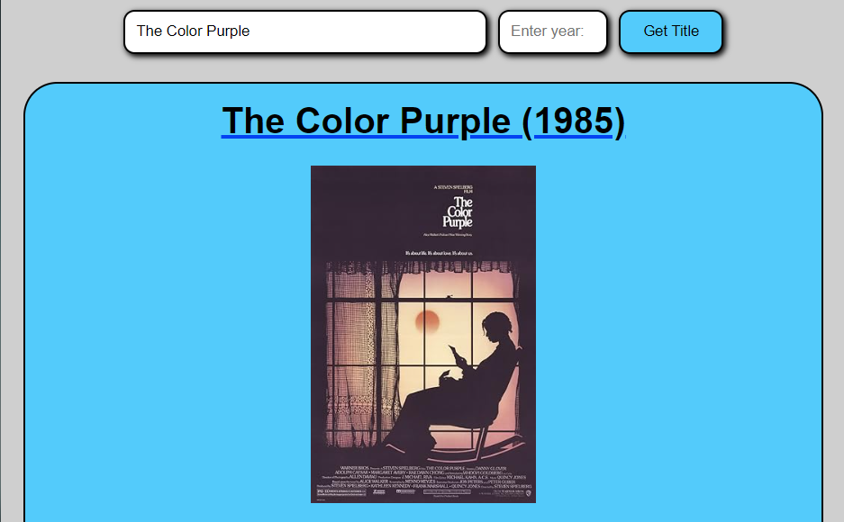
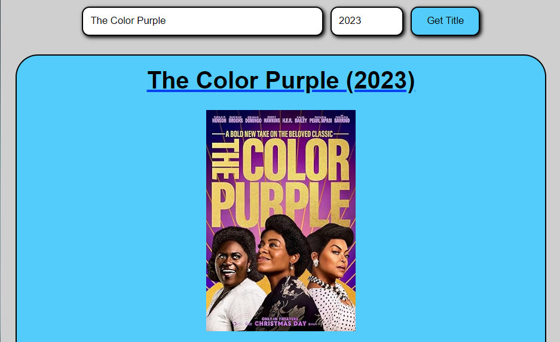

# Movie Search

## About The Project
This project lets users input a title of a movie or series and read details about them, much akin to websites such as IMDb and Rotten Tomatoes. Each result will display details about the title you searched, including its runtime, actors, genre, plot.

This project was made when I first learned HTML, CSS, and JavaScript. While I was learning JavaScript, I followed along a video showing how to make a weather app, which showed how to fetch data from an api and create and use DOM elements to show information on a page. Between that and my love for movies and shows, I was inspired to make this project.

I faced issues with using this api, creating and excluding various DOM elements when fetched data excluded certain fields, and implementing an optional search field, Year. But through this, I refined my skills with the basics of CSS and JavaScript.

### Built With
- HTML5
- CSS3
- JavaScript

## Usage
This project features two entry fields for a title and year of release. The year field is optional, but it can help refine your searches. To submit searches, hit the 'Get Title' button.

Searching for a movie will return the following information:
- Title (Year of release)
- Rating
- Release date
- Runtime
- Genre
- Director(s)
- Writer(s)
- Actors
- Plot

Searching for a series will return different information than a movie, such as:
- Title (Years of runtime)
- Rating
- Premiere date
- Total seasons
- Genre
- Writer(s)
- Actors
- Plot

Search results sometimes will omit information if the fetched data does not include specific information. For example, if fetched data does not contain any data for writers, the field will be omitted from the search results.

As mentioned, the year input field can specify the title you're searching for. This is especially useful for entries with the same title or remakes of a movie or series. For example, searching "The Color Purple" with no year will return a different result than searching with the year 2023.

Example with no year:

Example with year:

The OMDb contains thousands of entries, allowing you to search for most titles you can think of. Did you know there is a movie called "Paint Drying"?

A search will not display a valid result when:
- The title field is empty
- The year field is filled, but the title field is empty
- The year field is not exactly four digits long
- OMDb does not have data for a title

## Credits
- [Bro Code's Weather App Tutorial](https://www.youtube.com/watch?v=VaDUGPMjzOM&list=PLZPZq0r_RZOO1zkgO4bIdfuLpizCeHYKv&index=80 "Bro Code Weather App") : Inspiration and code help
- [The Open Movie Database (OMDb)](https://www.omdbapi.com/ "OMDb") : API used to fetch results
- [GitHub Pages](https://pages.github.com/ "GitHub Pages") : Used to host project online
- [40+ Best Blue Color Websites (With Color Schemes)](https://blog.magezon.com/best-blue-websites-with-schemes-ecm/ "Magezon") : Used to help choose color scheme